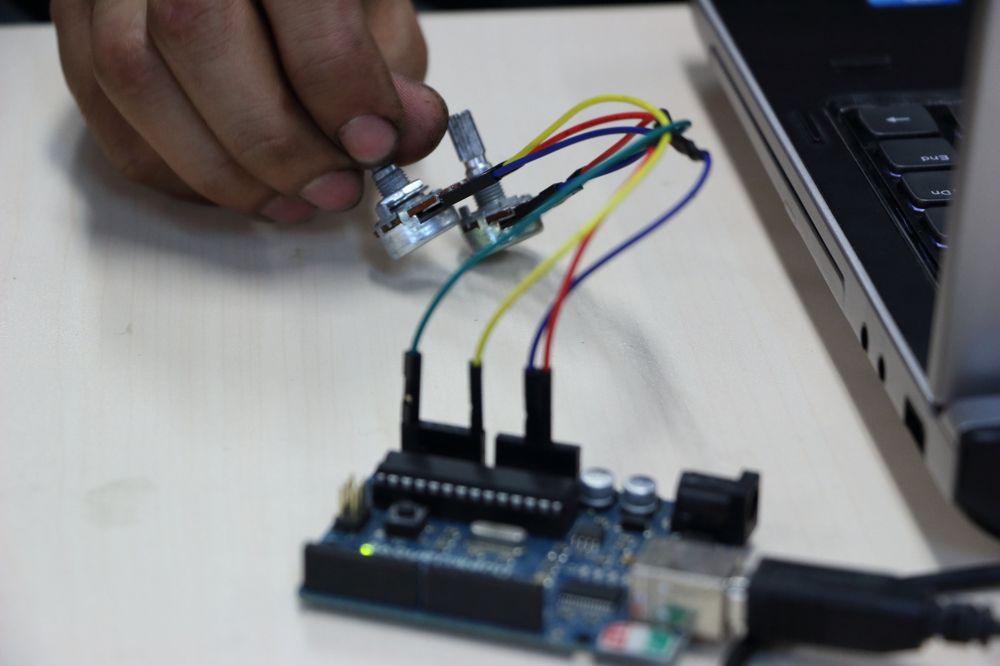

# Pong com potenciômetros, versão dojo
Atividade inspirada na metodologia [Coding Dojo](https://pt.wikipedia.org/wiki/Coding_Dojo), na qual participantes experimentam *baby steps* em direção à solução de um desafio, todos circulando, se revezando, no papéis de piloto e co-piloto, com trocas a cada 5 minutos.

0. **[Preparação]** [Instalar Processing Modo Python](villares.github.io/como-instalar-o-processing-modo-python/), baixar no próprio IDE do Processing a biblioteca Firmata(Arduino). Conectar um Arduino ao computador com cabo USB. Instalar no Arduino o sketch 'Firmata All Inputs'. Conectar os pinos centrais de dois potenciômetros aos pinos A0 e A5 do Arduino (um em cada). Quanto aos outros dois pinos de cada potenciômetro, um vai em GND e o outro em +5V.
1. **[Primeiro desafio]** Alterar o código em `potenciometros.pyde`, que inicialmente produz dois círculos com os tamanhos controlados pelos potenciômetros, para obtermos dois jogadores retangulares que se movem verticalmente;
2. **[Desafio Final]** Transferir o código de leitura dos potenciômetros via Arduino, do arquivo anterior, para fazer com que o jogo em `pong-sem-potenciometros.pyde` passe a ter os seus jogadores controlados pelos potenciômetros.
